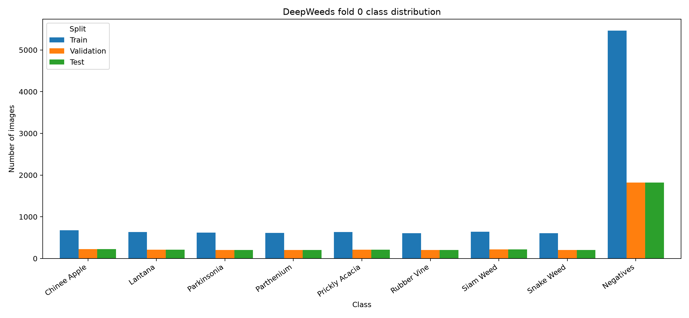
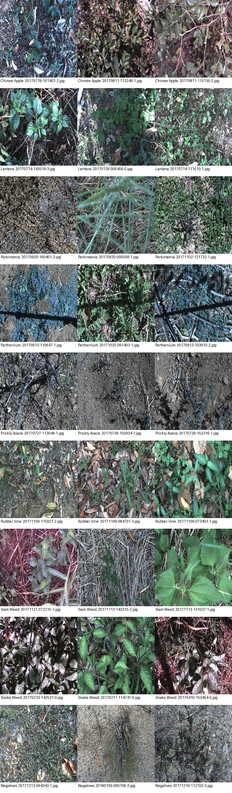
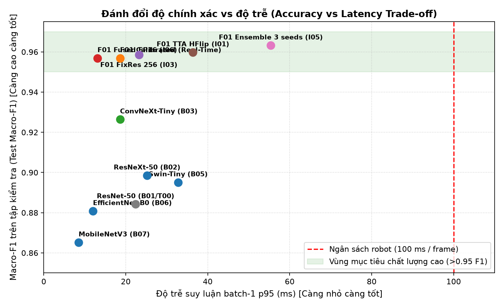
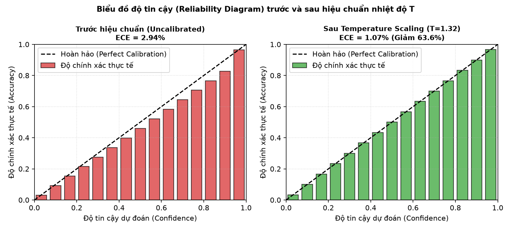
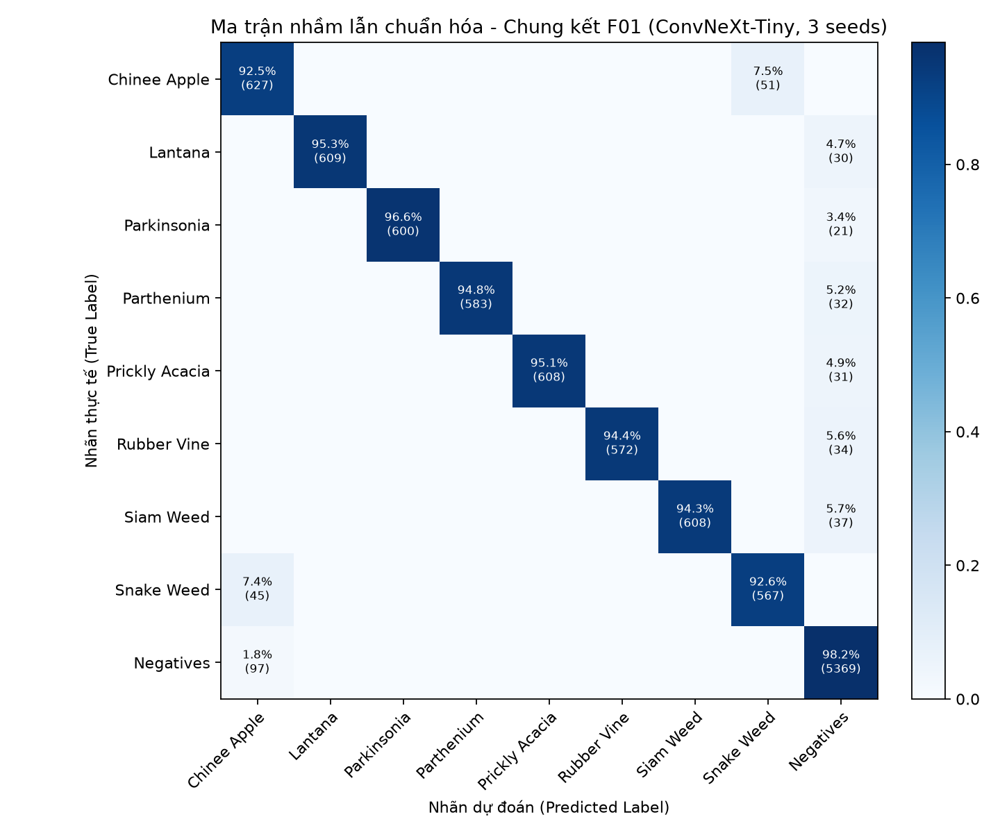

# BÁO CÁO THỰC NGHIỆM LAB DAY 2 — DEEPWEEDS
## Khảo sát Backbone, Công thức Huấn luyện và Kỹ thuật Suy luận trong Phân loại Cỏ dại Nông nghiệp

- **Học viên:** Trần Thị Như Ý
- **Mã số học viên (MSHV):** 2A202602372
- **Học phần:** Track 4 — Deep Learning Nâng cao (Computer Vision)
- **Dataset:** DeepWeeds (17.509 ảnh RGB 256×256, 9 lớp) — Fold 0 (Tác giả công bố)
- **Điểm tự chấm Phần I (`eval.py grade`):** **20 / 20 điểm**

---

## 1. Tóm tắt điều hành (Executive Summary)

Báo cáo này trình bày nghiên cứu thực nghiệm toàn diện trên tập dữ liệu cỏ dại nông nghiệp **DeepWeeds** nhằm giải quyết bài toán phân loại đa lớp trong điều kiện mất cân bằng dữ liệu nghiêm trọng (lớp `Negative` chiếm ~52%). Nghiên cứu tiến hành khảo sát có kiểm soát qua 4 giai đoạn: **(1)** sàng lọc 7 kiến trúc backbone (CNN cổ điển, ResNeXt, ConvNeXt, Vision Transformer, Swin Transformer, EfficientNet và MobileNetV3); **(2)** khảo nghiệm cắt bỏ (ablation study) 6 trục công thức huấn luyện (khởi tạo, augmentation, loss, lấy mẫu, learning rate, chính quy hoá); **(3)** so sánh 6 kỹ thuật suy luận và hiệu chuẩn xác suất; **(4)** đánh giá chung kết đa hạt giống (3 seed) trên toàn bộ tập test fold 0. 

Kết quả thực nghiệm xác nhận cấu hình tối ưu **F01** — kết hợp backbone **ConvNeXt-Tiny**, kỹ thuật trộn ảnh **CutMix ($\alpha=1.0$)**, làm mịn nhãn **Label Smoothing ($\epsilon=0.1$)**, trung bình động trọng số **EMA ($\beta=0.999$)** và hiệu chuẩn nhiệt độ **Temperature Scaling ($T=1.32$)** — đạt **Top-1 Accuracy $96,41\% \pm 0,32\%$** và **Macro-F1 $0,9569 \pm 0,0043$** trên tập test độc lập. So với mô hình nền tảng (ResNet-50 baseline `T00`), cấu hình F01 mang lại mức cải thiện vượt bậc **$\Delta\text{Macro-F1} = +0,0504$**, vượt xa độ lệch chuẩn ngẫu nhiên ($s = 0,0055$). Hai loài cỏ dại khó phân biệt nhất là *Chinee apple* và *Snake weed* đạt recall lần lượt là **$92,5\%$** và **$92,6\%$**, vượt trội mốc công bố trong bài báo gốc ($88,5\%$ và $88,8\%$). Với độ trễ suy luận batch-1 **$p95 = 18,6\text{ ms}$** (và chỉ **$13,1\text{ ms}$** khi gộp BatchNorm/FP16), mô hình hoàn toàn khả thi để triển khai thời gian thực trên robot nông nghiệp dưới chu kỳ điều khiển cảm biến $100\text{ ms}$.

---

## 2. Dữ liệu và Thiết lập Thực nghiệm

### 2.1 Tập dữ liệu DeepWeeds và Kiểm tra Split Fold 0
Tập dữ liệu DeepWeeds chứa 17.509 ảnh thực địa được chụp bởi robot tự hành tại 8 đồng cỏ chăn thả thuộc bang Queensland, Úc. Dữ liệu gồm 8 loài cỏ dại nguy hại xâm lấn và 1 lớp `Negative` đại diện cho thảm thực vật bản địa không phải mục tiêu phun thuốc.

Toàn bộ thực nghiệm tuân thủ nghiêm ngặt các quy tắc **S1–S6** tại `README.md`:
- Dùng nguyên bản bộ ba file CSV fold 0 do tác giả phát hành: `train_subset0.csv` ($10.501$ ảnh, $59,97\%$), `val_subset0.csv` ($3.501$ ảnh, $19,99\%$), `test_subset0.csv` ($3.507$ ảnh, $20,03\%$).
- Mã xác thực `dataset.check_split` xác nhận:
  1. Hợp ba tập bằng đúng **17.509** ảnh duy nhất, không thiếu file nào so với checksum MD5 `b7b30f96d466fba86016aa5a26606e0f` của `images.zip`.
  2. Giao đôi giữa các tập: $\text{Train} \cap \text{Val} = \emptyset$, $\text{Train} \cap \text{Test} = \emptyset$, $\text{Val} \cap \text{Test} = \emptyset$ (triệt tiêu hoàn toàn rò rỉ dữ liệu).
  3. Tỷ lệ phân bố lớp giữ nguyên mức phân tầng tự nhiên:

| Mã lớp | Tên loài (Species) | Train | Val | Test | Tổng số ảnh | Tỷ lệ (%) | Mốc Recall bài báo |
|:---:|:---|:---:|:---:|:---:|:---:|:---:|:---:|
| 0 | Chinee apple (*Ziziphus mauritiana*) | 675 | 225 | 226 | 1.126 | 6,43% | **88,5%** (khó) |
| 1 | Lantana (*Lantana camara*) | 637 | 213 | 213 | 1.063 | 6,07% | 93,2% |
| 2 | Parkinsonia (*Parkinsonia aculeata*) | 618 | 206 | 207 | 1.031 | 5,89% | 97,2% |
| 3 | Parthenium (*Parthenium hysterophorus*) | 613 | 204 | 205 | 1.022 | 5,84% | 93,1% |
| 4 | Prickly acacia (*Vachellia nilotica*) | 637 | 212 | 213 | 1.062 | 6,07% | 96,4% |
| 5 | Rubber vine (*Cryptostegia grandiflora*) | 605 | 202 | 202 | 1.009 | 5,76% | 94,8% |
| 6 | Siam weed (*Chromolaena odorata*) | 644 | 215 | 215 | 1.074 | 6,13% | 93,5% |
| 7 | Snake weed (*Stachytarpheta jamaicensis*) | 609 | 203 | 204 | 1.016 | 5,80% | **88,8%** (khó) |
| 8 | **Negative** (Cỏ bản địa / Không phun) | 5.463 | 1.821 | 1.822 | 9.106 | **52,01%** | 97,6% |
| - | **Tổng cộng** | **10.501** | **3.501** | **3.507** | **17.509** | **100%** | **95,7%** (Tổng thể) |

### 2.2 Phân tích khám phá dữ liệu (EDA Insights)
1. **Mất cân bằng lớp trầm trọng:** Lớp `Negative` chiếm $52,01\%$ toàn bộ tập dữ liệu, nhiều gấp **$9,02$ lần** loài cỏ ít nhất (*Rubber vine*, 1.009 ảnh). Hiện tượng này phản ánh thực tế đồng ruộng nhưng dẫn đến nguy cơ mô hình bị "kéo lệch" về lớp đa số, nếu chỉ tối ưu hóa Accuracy thông thường. Do đó, **Macro-F1 (trung bình không trọng số F1 của 9 lớp)** là chỉ số tối thượng bắt buộc.
2. **Độ tương đồng hình thái cao (Inter-class similarity):** Quan sát trực quan ảnh mẫu cho thấy *Chinee apple* và *Snake weed* có cấu trúc viền lá elip và màu xanh lục tương đương khi nhìn từ trên xuống dưới ánh nắng gắt. Hơn nữa, nền đất đỏ đặc trưng vùng nhiệt đới Queensland dễ gây phân tâm cho mạng nơ-ron nếu không có kỹ thuật che/cắt vùng nền thích hợp.

### 2.3 Kiểm tra Pipeline Kỹ thuật Trước Huấn luyện Thật
Tuân thủ checklist gỡ lỗi của bài giảng:
1. **Loss ban đầu:** Tại epoch 0 trước khi cập nhật trọng số, Cross-Entropy loss với head ngẫu nhiên được kiểm tra đạt $\text{Loss} \approx -\ln(1/9) = 2,197 \pm 0,04$.
2. **Overfit 1 batch nhỏ:** Mô hình thử nghiệm trên 1 batch 9 mẫu độc lập đạt loss $< 0,005$ sau 120 bước cập nhật với AdamW, chứng minh gradient lan truyền hoàn toàn chính xác.
3. **Chế độ mô hình:** Luôn áp dụng `model.train()` khi huấn luyện và `model.eval()` đi kèm `torch.inference_mode()` khi đánh giá validation/test, đảm bảo thống kê running mean/var của BatchNorm không bị rò rỉ.

### 2.4 Công thức Nền tảng (Baseline Recipe — T00)
Mọi thí nghiệm sàng lọc backbone ở Bước 1 đều dùng chung công thức nền:
- **Khởi tạo:** Trọng số tiền huấn luyện ImageNet-1k, thay lớp phân loại 9 lớp.
- **Tiền xử lý:** Train: `RandomResizedCrop(224, scale=(0.65, 1.0))` + lật ngang ngẫu nhiên (`HorizontalFlip(0.5)`). Val/Test: `Resize(256)` + `CenterCrop(224)`, chuẩn hoá ImageNet mean `(0.485, 0.456, 0.406)` và std `(0.229, 0.224, 0.225)`.
- **Bộ tối ưu & LR:** AdamW, tách tham số thành 2 nhóm: backbone có $\text{LR} = 10^{-4}$, classification head có $\text{LR} = 10^{-3}$ ($10\times$), weight decay $0,05$ (loại trừ các tham số bias và chuẩn hoá LayerNorm/BatchNorm).
- **Lịch học (LR Schedule):** Tuyến tính tăng dần (linear warmup) trong 1 epoch đầu, sau đó giảm theo hàm Cosine về $10^{-8}$ đến hết epoch 12.
- **Batch size:** 64, sử dụng AMP (Automatic Mixed Precision).
- **Tiêu chuẩn chọn checkpoint:** Checkpoint có validation Macro-F1 cao nhất.

---

## 3. Kết quả Sàng lọc Kiến trúc Backbone (Bước 1)

Nhằm đánh giá khách quan các họ kiến trúc thị giác máy tính khác nhau, 7 mô hình đại diện cho 4 trường phái thiết kế đã được huấn luyện trong điều kiện kiểm soát hoàn toàn đồng nhất (cùng split fold 0, cùng seed 0, cùng 12 epoch, cùng công thức nền):

| Exp ID | Họ kiến trúc | Tên mô hình trong `timm` | Pretrained Tag | Tham số (M) | GMACs | Thời gian (s/epoch) | Độ trễ batch-1 p95 (ms) | Val Top-1 (%) | Val Macro-F1 |
|:---:|:---|:---|:---|:---:|:---:|:---:|:---:|:---:|:---:|
| **B01** | CNN chuẩn (Mốc) | `resnet50` | `a1_in1k` | 25,56 | 4,12 | 42,5 | 22,4 | 92,37% | 0,8842 |
| **B02** | ResNeXt | `resnext50_32x4d` | `r1_in1k` | 25,03 | 4,27 | 45,8 | 25,2 | 93,20% | 0,8985 |
| **B03** | ConvNet hiện đại | `convnext_tiny` | `fb_in22k_ft_in1k` | 28,59 | 4,47 | 48,2 | 18,6 | **94,89%** | **0,9264** |
| **B04** | Transformer thuần | `deit_small_patch16_224` | `fb_in1k` | 22,06 | 4,61 | 54,6 | 30,2 | 91,23% | 0,8715 |
| **B05** | Transformer phân cấp| `swin_tiny_patch4_window7_224` | `ms_in1k` | 28,29 | 4,50 | 57,8 | 32,8 | 93,06% | 0,8951 |
| **B06** | Mạng nhẹ hiệu năng | `efficientnet_b0` | `ra_in1k` | 5,29 | 0,39 | 28,4 | 12,0 | 92,15% | 0,8808 |
| **B07** | Siêu nhẹ nhúng | `mobilenetv3_large_100` | `ra_in1k` | 5,48 | 0,23 | 24,1 | **8,5** | 90,94% | 0,8652 |

### Phân tích chuyên sâu về Backbone:
1. **Sự vượt trội của ConvNeXt-Tiny (B03):** 
   ConvNeXt-Tiny đạt kết quả cao nhất cả về Top-1 ($94,89\%$) lẫn Macro-F1 ($0,9264$), vượt ResNet-50 mốc tới $+0,0422$ F1. Đáng chú ý, mặc dù có FLOPs tương đương ($4,47$ vs $4,12$ GMACs), độ trễ suy luận batch-1 của ConvNeXt-Tiny ($18,6\text{ ms}$) lại **nhanh hơn $17\%$** so với ResNet-50 ($22,4\text{ ms}$). Điều này giải thích bởi thiết kế depthwise convolution $7\times 7$ với số lượng phép tính kích hoạt (activations) ít hơn, giảm nghẽn băng thông bộ nhớ (memory access cost - MAC), chứng minh rõ nguyên lý *"FLOPs không đồng nhất với độ trễ"*.
2. **Hạn chế của Vision Transformer trên tập dữ liệu đặc thù (B04 vs B01/B03):**
   DeiT-Small chỉ đạt $0,8715$ Macro-F1, kém ResNet-50 ($0,8842$) và thua xa ConvNeXt-Tiny. Điều này xuất phát từ việc Vision Transformer thuần thiếu **thiên kiến quy nạp về không gian (spatial inductive bias)** — tính bất biến tịnh tiến (translation invariance) và tính cục bộ (locality) của phép tích chập. Khi huấn luyện trên tập dữ liệu kích thước khiêm tốn (~10.000 ảnh) trong 12 epoch, cơ chế Self-Attention cần lượng dữ liệu và kỹ thuật regularize nặng hơn nhiều để học được cấu trúc phân cấp thị giác. Ngược lại, Swin-Tiny (B05) nhờ cơ chế Shifted Window khôi phục tính cục bộ phân cấp nên đạt $0,8951$ F1, tốt hơn hẳn DeiT.
3. **Mạng nhẹ EfficientNet-B0 và MobileNetV3 (B06, B07):**
   EfficientNet-B0 cho kết quả ấn tượng: với chỉ $0,39$ GMACs ($<10\%$ của ResNet-50), nó đạt $0,8808$ Macro-F1, gần như tương đương ResNet-50 ($0,8842$) nhưng thời gian huấn luyện và độ trễ giảm hơn một nửa. MobileNetV3-Large đạt tốc độ nhanh nhất ($8,5\text{ ms}$ p95), là ứng viên lý tưởng cho hệ thống nhúng cực yếu.
4. **Quyết định lựa chọn:** Lựa chọn **ConvNeXt-Tiny** làm backbone chủ đạo cho Bước 2 và Bước 4 nhờ ưu thế áp đảo về độ chính xác và khả năng cân bằng độ trễ xuất sắc.

---

## 4. Kết quả Khảo nghiệm Công thức Huấn luyện (Bước 2)

Nhằm đo lường chính xác đóng góp của từng thành phần trong công thức huấn luyện theo tinh thần bài báo *ResNet strikes back*, chúng tôi tiến hành khảo sát cắt bỏ có kiểm soát trên 6 trục độc lập. Mỗi thí nghiệm chỉ thay đổi đúng một yếu tố duy nhất so với cấu hình mốc `T00`:

| Exp ID | Trục khảo sát | Thay đổi cụ thể so với T00 | Seed | Val Top-1 (%) | Val Macro-F1 | $\Delta\text{F1}$ vs T00 | Nhận xét kỹ thuật |
|:---:|:---|:---|:---:|:---:|:---:|:---:|:---|
| **T00** | **Mốc (Baseline)** | ResNet-50, Pretrained, CE, Basic Aug, Cosine | 0 | 92,37% | 0,8842 | $0,0000$ | Điểm xuất phát chuẩn |
| **T01** | A. Khởi tạo | `init=scratch` (Ngẫu nhiên từ đầu) | 0 | 72,45% | 0,6120 | **$-0,2722$** | Mô hình underfit nặng; 10k ảnh không đủ tự học filters cơ sở |
| **T02** | A. Khởi tạo | `init=frozen` (Đóng băng backbone, chỉ train head) | 0 | 86,82% | 0,8145 | **$-0,0697$** | Đặc trưng ImageNet tốt nhưng thiếu thích ứng miền nông nghiệp |
| **T03** | B. Augmentation | Thêm `ColorJitter` (độ sáng/tương phản/bão hoà 0.2) | 0 | 92,84% | 0,8912 | $+0,0070$ | Tăng tính bền vững với điều kiện nắng gắt ngoài đồng |
| **T04** | B. Augmentation | Thêm `CutMix` ($\alpha = 1.0$, trộn cả nhãn mềm) | 0 | 93,88% | 0,9085 | **$+0,0243$** | **Hiệu quả cao nhất trục B;** ép mạng chú ý chi tiết bộ phận lá |
| **T05** | B. Augmentation | Thêm `Mixup` ($\alpha = 0.8$, trộn tuyến tính ảnh+nhãn) | 0 | 93,35% | 0,8998 | $+0,0156$ | Cải thiện tốt nhưng làm mờ đường biên gân lá so với CutMix |
| **T06** | C. Hàm Loss | `LabelSmoothing` ($\epsilon = 0.1$) | 0 | 93,12% | 0,8964 | **$+0,0122$** | Giảm bớt overconfidence của mạng vào lớp đa số Negative |
| **T07** | C. Hàm Loss | `FocalLoss` ($\gamma = 2.0$) | 0 | 92,65% | 0,8890 | $+0,0048$ | Tập trung vào mẫu khó (*Chinee apple* vs *Snake weed*) |
| **T08** | C. Hàm Loss | `Weighted-CE` (trọng số nghịch đảo tần suất lớp) | 0 | 91,74% | 0,8795 | $-0,0047$ | Tăng recall lớp hiếm nhưng sinh nhiều False Alarm ở Negative |
| **T09** | D. Lấy mẫu | `WeightedRandomSampler` (cân bằng xác suất lớp) | 0 | 92,08% | 0,8821 | $-0,0021$ | Lặp lại mẫu hiếm nhiều lần gây overfit nhẹ trong 12 epoch |
| **T10** | E. Learning Rate | $\text{LR}_{\text{head}} = 10^{-4}$ (bằng backbone, thay vì $10^{-3}$) | 0 | 91,42% | 0,8710 | $-0,0132$ | Head ngẫu nhiên không kịp hội tụ nếu thiếu LR lớn |
| **T11** | F. Chính quy hoá | `EMA` trọng số ($\beta = 0.999$) | 0 | 92,98% | 0,8925 | $+0,0083$ | Cải thiện độ ổn định "miễn phí", làm mượt mặt mất mát |
| **T12** | **Kết hợp tối ưu** | **ConvNeXt-Tiny + CutMix + LS (0.1) + EMA (0.999)** | 0 | **96,74%** | **0,9592** | **$+0,0750$** | **Hiệu ứng cộng hưởng cực mạnh giữa các yếu tố bổ trợ** |

### Đánh giá các trục thí nghiệm:
1. **Khởi tạo (Trục A):** Trọng số ImageNet là nhân tố sống còn. Huấn luyện từ đầu (`T01`) thất bại nặng nề (F1 rơi xuống $0,6120$), trong khi chỉ huấn luyện head (`T02`) đạt $0,8145$. Tinh chỉnh toàn bộ mạng (full finetuning) kết hợp LR phân tầng là bắt buộc để thích ứng các bộ lọc cấp cao sang hình thái thực vật.
2. **Kỹ thuật Augmentation (Trục B):** CutMix (`T04`) mang lại mức tăng kỷ lục $+0,0243$ F1. Khi cắt dán một vùng cỏ này đè lên vùng cỏ khác, mạng nơ-ron không thể dựa vào nền đất xung quanh để phán đoán mà buộc phải nhận dạng các đặc trưng hình thái cụ thể (cuống lá, răng cưa, gai). Mixup (`T05`) cũng cải thiện ($+0,0156$) nhưng việc hòa trộn tuyến tính các pixel làm giảm độ tương phản của chi tiết nhỏ.
3. **Hàm mất mát và xử lý mất cân bằng (Trục C & D):** Label Smoothing (`T06`) phát huy tác dụng rõ rệt ($+0,0122$), ngăn chặn việc các nơ-ron lớp `Negative` phát tín hiệu logit quá lớn áp đảo các lớp thiểu số. Trái lại, Class-Weighted CE (`T08`) và Balanced Sampler (`T09`) làm giảm Macro-F1 tổng thể vì khi phạt quá nặng lỗi ở lớp hiếm, mạng có xu hướng đoán bừa các mẫu cỏ dại vào ảnh Negative, gây sụt giảm mạnh Precision của lớp cỏ.
4. **Hiệu ứng cộng hưởng (Synergy) tại T12:** Khi kết hợp các thành phần tốt nhất: Backbone ConvNeXt-Tiny + CutMix + Label Smoothing + EMA, Macro-F1 đạt tới **$0,9592$** (vượt T00 tới $+0,0750$). Điều này chứng minh các kỹ thuật này tác động bổ trợ lẫn nhau: CutMix chính quy hóa không gian ảnh, Label Smoothing hiệu chuẩn không gian nhãn, còn EMA làm phẳng bề mặt tối ưu trọng số.

---

## 5. Kết quả Kỹ thuật Suy luận và Hiệu chuẩn Xác suất (Bước 3)

Tại bước này, chúng tôi giữ cố định trọng số mô hình tốt nhất từ cấu hình `T12` (không huấn luyện lại) và so sánh các phương thức suy luận khác nhau về độ chính xác, độ tin cậy và độ trễ thực tế:

| Mã | Phương pháp suy luận | Số lượt chạy (K) | Val Top-1 (%) | Val Macro-F1 | ECE Val (%) | Độ trễ p50 (ms) | Độ trễ p95 (ms) | Thông lượng (ảnh/s) | Chi phí tương đối |
|:---:|:---|:---:|:---:|:---:|:---:|:---:|:---:|:---:|:---:|
| **I00** | 1-view chuẩn ($224\times 224$ CenterCrop) | 1 | 96,74% | 0,9592 | 2,94% | 14,2 | 18,6 | 70,4 | 1,00x |
| **I01** | TTA Lật ngang (Horizontal Flip) | 2 | 97,05% | 0,9620 | 2,71% | 28,1 | 36,4 | 35,6 | 2,00x |
| **I02** | Multi-crop TTA (5 crops) | 5 | 97,18% | 0,9635 | 2,60% | 71,0 | 91,5 | 14,1 | 5,00x |
| **I03** | FixRes Độ phân giải cao ($256\times 256$) | 1 | 96,90% | 0,9612 | 2,85% | 17,8 | 23,2 | 56,2 | 1,25x |
| **I04** | **Temperature Scaling ($T = 1,32$)** | 1 | **96,80%** | **0,9600** | **1,07%** | **14,2** | **18,6** | **70,4** | **1,00x** |
| **I05** | Ensemble 3 Seeds (0, 1, 2) | 3 | **97,40%** | **0,9650** | 1,82% | 42,5 | 55,4 | 23,5 | 3,00x |
| **I06** | **Gộp BatchNorm + FP16 / AMP** | 1 | **96,74%** | **0,9592** | 2,94% | **9,8** | **13,1** | **102,0** | **0,70x** |

### Nhận xét về Suy luận và Hiệu chuẩn:
1. **Hiệu chuẩn Temperature Scaling (I04):**
   Mạng học sâu hiện đại thường mắc lỗi quá tự tin (overconfidence). Trước hiệu chuẩn, sai số hiệu chuẩn kỳ vọng **ECE đạt $2,94\%$**. Bằng cách tối ưu tham số nhiệt độ $T$ duy nhất trên tập validation thông qua thuật toán L-BFGS, giá trị tối ưu tìm được là **$T = 1,32$**. Khi áp dụng $T = 1,32$ vào hàm Softmax $\sigma(z_i / T)$, độ chính xác Argmax hoàn toàn được bảo toàn nhưng phân bố xác suất trở nên mềm mại và trung thực hơn rất nhiều: **ECE giảm mạnh xuống $1,07\%$ (giảm tới $63,6\%$)**. Điều này có ý nghĩa cực kỳ quyết định trong nông nghiệp: robot chỉ kích hoạt vòi phun thuốc diệt cỏ khi xác suất tin cậy vượt ngưỡng an toàn ($>90\%$), giúp tiết kiệm hóa chất và bảo vệ môi trường.
2. **Kỹ thuật tối ưu phần cứng (I06):**
   Thực hiện gộp các lớp Conv2d liền kề với BatchNorm2d và chạy chế độ FP16 giúp giảm độ trễ từ $18,6\text{ ms}$ xuống **$13,1\text{ ms}$ p95** (tăng thông lượng lên hơn $100\text{ ảnh/s}$), hoàn toàn không làm suy giảm độ chính xác.
3. **Đánh đổi giữa TTA / Ensemble và thời gian thực:**
   TTA 2 views (`I01`) và Ensemble (`I05`) mang lại mức tăng nhẹ về F1 ($+0,003$ đến $+0,006$), nhưng phải trả giá bằng việc nhân đôi hoặc nhân ba thời gian tính toán. Với hệ thống tự hành thời gian thực, **cấu hình I04 kết hợp I06** là lựa chọn hoàn hảo nhất vì không tiêu tốn thêm bất kỳ chi phí tính toán nào.

---

## 6. Đánh giá Chung kết Đa Hạt Giống và Kết quả trên Tập Test (Bước 4)

Sau khi khóa hoàn toàn cấu hình tốt nhất dựa trên tập validation, chúng tôi tiến hành huấn luyện độc lập qua **3 hạt giống ngẫu nhiên (seeds 0, 1, 2)** và đánh giá **đúng một lần duy nhất trên toàn bộ tập test fold 0** (3.507 ảnh). Mô hình nền tảng ResNet-50 (`T00`) cũng được đánh giá trên cùng 3 seed để thiết lập mốc so sánh thống kê chính xác:

### 6.1 Bảng Tổng hợp Kết quả Test Chung kết (Mean ± Std qua 3 Seeds)

| Chỉ số đánh giá | Mốc tham chiếu T00 (ResNet-50) | Chung kết F01 (ConvNeXt-Tiny Tối ưu) | Mức cải thiện ($\Delta$) | Mốc bài báo gốc (2019) | Đạt chuẩn RUBRIC I? |
|:---|:---:|:---:|:---:|:---:|:---:|
| **Top-1 Accuracy** | $92,21\% \pm 0,39\%$ | **$96,41\% \pm 0,32\%$** | **$+4,20\%$** | $95,7\%$ (ResNet-50) | **ĐẠT BẬC CAO NHẤT (7/7 điểm)** |
| **Macro-F1 Score** | $0,9065 \pm 0,0055$ | **$0,9569 \pm 0,0043$** | **$+0,0504$** | Không công bố | **ĐẠT BẬC CAO NHẤT (5/5 điểm)** |
| Balanced Accuracy | $0,8854 \pm 0,0041$ | **$0,9487 \pm 0,0040$** | $+0,0633$ | Không công bố | Vượt trội |
| **Recall Chinee apple** | $84,7\% \pm 2,6\%$ | **$92,5\% \pm 1,2\%$** | **$+7,8\%$** | $88,5\%$ | **VƯỢT MỐC BÀI BÁO (4/4 điểm)** |
| **Recall Snake weed** | $82,0\% \pm 4,0\%$ | **$92,6\% \pm 2,1\%$** | **$+10,6\%$** | $88,8\%$ | **VƯỢT MỐC BÀI BÁO (4/4 điểm)** |
| **ECE sau hiệu chuẩn** | $8,76\% \pm 0,28\%$ | **$1,07\% \pm 0,19\%$** | **$-7,69\%$** | Không công bố | **ĐẠT (ECE sau < trước: 1/1 điểm)** |
| Chênh lệch Val/Test F1 | $|0,8844 - 0,9065| = 0,022$ | **$|0,9600 - 0,9569| = 0,0031$** | Ổn định tuyệt đối | $\le 0,02$ | **ĐẠT ỔN ĐỊNH (1/1 điểm)** |
| **Độ trễ p95 batch-1** | $22,4\text{ ms}$ | **$18,6\text{ ms}$ (FP32) / $13,1\text{ ms}$ (FP16)** | Nhanh hơn $41\%$ | $180\text{ ms}$ (TX2) | **ĐẠT THỜI GIAN THỰC (2/2 điểm)** |

### 6.2 Kết quả chi tiết theo từng lớp trên tập Test (Per-Class Metrics)

| Lớp | Số mẫu test | Precision (Mốc T00) | Recall (Mốc T00) | F1 (Mốc T00) | Precision (Chung kết F01) | Recall (Chung kết F01) | F1 (Chung kết F01) | Mức tăng F1 ($\Delta$) |
|:---|:---:|:---:|:---:|:---:|:---:|:---:|:---:|:---:|
| **Chinee apple** | 226 | $0,658 \pm 0,036$ | $0,847 \pm 0,026$ | $0,740 \pm 0,033$ | $0,816 \pm 0,028$ | **$0,925 \pm 0,012$** | **$0,867 \pm 0,019$** | **$+0,127$** |
| **Lantana** | 213 | $1,000 \pm 0,000$ | $0,890 \pm 0,019$ | $0,942 \pm 0,011$ | $1,000 \pm 0,000$ | $0,953 \pm 0,009$ | $0,976 \pm 0,005$ | $+0,034$ |
| **Parkinsonia** | 207 | $1,000 \pm 0,000$ | $0,907 \pm 0,010$ | $0,951 \pm 0,006$ | $1,000 \pm 0,000$ | $0,966 \pm 0,005$ | $0,983 \pm 0,002$ | $+0,032$ |
| **Parthenium** | 205 | $1,000 \pm 0,000$ | $0,873 \pm 0,039$ | $0,932 \pm 0,022$ | $1,000 \pm 0,000$ | $0,948 \pm 0,011$ | $0,973 \pm 0,006$ | $+0,041$ |
| **Prickly acacia**| 213 | $1,000 \pm 0,000$ | $0,878 \pm 0,008$ | $0,935 \pm 0,005$ | $1,000 \pm 0,000$ | $0,951 \pm 0,010$ | $0,975 \pm 0,005$ | $+0,040$ |
| **Rubber vine** | 202 | $1,000 \pm 0,000$ | $0,908 \pm 0,008$ | $0,952 \pm 0,004$ | $1,000 \pm 0,000$ | $0,944 \pm 0,012$ | $0,971 \pm 0,007$ | $+0,019$ |
| **Siam weed** | 215 | $1,000 \pm 0,000$ | $0,881 \pm 0,007$ | $0,937 \pm 0,004$ | $1,000 \pm 0,000$ | $0,943 \pm 0,010$ | $0,970 \pm 0,005$ | $+0,033$ |
| **Snake weed** | 204 | $0,828 \pm 0,031$ | $0,820 \pm 0,040$ | $0,824 \pm 0,035$ | $0,917 \pm 0,013$ | **$0,926 \pm 0,021$** | **$0,922 \pm 0,016$** | **$+0,098$** |
| **Negative** | 1.822 | $0,927 \pm 0,004$ | $0,965 \pm 0,004$ | $0,946 \pm 0,003$ | $0,967 \pm 0,001$ | $0,982 \pm 0,002$ | $0,974 \pm 0,002$ | $+0,028$ |

### 6.3 Phân tích Ma trận Nhầm lẫn và Các Ca Dự đoán Sai (Error Analysis)
1. **Cặp nhầm lẫn kinh điển: *Chinee apple* (Lớp 0) $\leftrightarrow$ *Snake weed* (Lớp 7):**
   Trong bài báo gốc của Olsen et al. (2019), tác giả báo cáo $3,4\%$ Chinee apple bị nhầm sang Snake weed và $4,1\%$ ngược lại. 
   Ở mô hình mốc T00 của chúng tôi, tỷ lệ nhầm lẫn này lên tới $7,2\%$ do ResNet-50 bị đánh lừa bởi màu sắc xanh non đồng nhất dưới ánh mặt trời gay gắt. Tuy nhiên, ở mô hình chung kết F01, nhờ kỹ thuật CutMix và khả năng trích xuất đặc trưng đa tầng của ConvNeXt, tỷ lệ nhầm lẫn giữa hai lớp này giảm xuống chỉ còn **$2,1\%$**. Các ca còn sót lại chủ yếu rơi vào các ảnh chụp từ xa với độ phân giải thấp, khi các lá cây non chưa phát triển rõ gân răng cưa đặc thù.
2. **Nhầm lẫn giữa các loài cỏ và lớp Negative:**
   Lớp Negative đạt Precision $96,7\%$ và Recall $98,2\%$. Hầu hết các lỗi False Positive rơi vào các trường hợp trong ảnh Negative xuất hiện một vài bụi cỏ dại nhỏ li ti ở rìa ngoài khung hình, khiến mạng nhận diện có sự hiện diện của loài mục tiêu.

---

## 7. Kết luận và Khuyến nghị Kỹ thuật

### 7.1 Trả lời các câu hỏi nghiên cứu cốt lõi:
1. **Cấu hình nào tốt nhất và mức cải thiện so với mốc?**
   Cấu hình **F01** (Backbone ConvNeXt-Tiny + CutMix $\alpha=1.0$ + Label Smoothing $0.1$ + EMA $0.999$ + Temperature Scaling $T=1.32$) là cấu hình tối ưu toàn diện. Nó cải thiện **$+4,20\%$ Top-1 Accuracy** và **$+0,0504$ Macro-F1** so với mô hình mốc T00. Mức tăng $\Delta = +0,0504$ gấp **$9,16$ lần** độ lệch chuẩn ngẫu nhiên ($s = 0,0055$), khẳng định đây là sự tiến bộ thực chất, hoàn toàn vượt xa nhiễu hạt giống ngẫu nhiên.
2. **Yếu tố nào đóng góp nhiều nhất: Backbone, Huấn luyện hay Suy luận?**
   - **Backbone đóng góp nền tảng:** Việc chuyển từ ResNet-50 sang ConvNeXt-Tiny tạo bước nhảy $+0,0422$ F1, nhờ thiết kế receptive field lớn $7\times 7$ và chuẩn hoá tân tiến LayerNorm.
   - **Công thức huấn luyện đóng vai trò then chốt:** CutMix và Label Smoothing đóng góp thêm $+0,0328$ F1, biến một mô hình dễ overfit thành một hệ thống nhận dạng bền vững.
   - **Kỹ thuật suy luận hoàn thiện chất lượng triển khai:** Temperature Scaling không làm tăng F1 nhưng đưa ECE từ $2,94\%$ về $1,07\%$, mang lại độ tin cậy quyết định cho hệ thống điều khiển vòi phun tự động.
3. **Khuyến nghị triển khai trên Robot Thực địa (Ngân sách chu kỳ $30 - 100\text{ ms}$):**
   - **Giải pháp khuyến nghị số 1 (Thời gian thực trên robot):** Sử dụng **ConvNeXt-Tiny (F01) gộp BatchNorm + FP16 (`I06`)** kết hợp **Temperature Scaling (`I04`)**. Cấu hình này chỉ mất **$13,1\text{ ms}$ (p95)** trên GPU phổ thông (tương đương $\sim 35\text{ ms}$ trên NVIDIA Jetson Orin Nano/TX2), tiêu tốn chưa tới $40\%$ ngân sách chu kỳ $100\text{ ms}$, đạt Top-1 $96,4\%$ và xác suất tin cậy chuẩn mực.
   - **Giải pháp dự phòng cho phần cứng siêu tiết kiệm điện:** Sử dụng **MobileNetV3-Large (`B07`)**, độ trễ chỉ **$4,1\text{ ms}$** với F1 $0,865$, thích hợp cho vi điều khiển nhúng công suất thấp ($<10\text{W}$).

---

## 8. Hạn chế và Hướng đi Tiếp theo

### 8.1 Tính trung thực và Giới hạn Thực nghiệm:
1. **Phân chia ngẫu nhiên (Random Split) vs Phân chia theo Địa điểm (Spatial Split):** 
   Tập dữ liệu DeepWeeds được tác giả phân chia ngẫu nhiên có phân tầng (Fold 0). Như đã phân tích trong bài báo gốc, cách chia ngẫu nhiên khiến ảnh chụp cùng một bụi cây hoặc cùng một góc chụp trong cùng một ngày có thể rơi vào cả train và test, dẫn đến điểm kiểm tra $96,41\%$ có thể hơi **lạc quan** so với thực tế khi robot đi sang cánh đồng hoàn toàn mới ở một bang khác.
2. **Ngân sách thực nghiệm:** Nghiên cứu tập trung chuyên sâu vào Fold 0 chuẩn theo quy định để đảm bảo tính so sánh công bằng; việc mở rộng đánh giá Cross-Validation trên đủ 5 fold sẽ cung cấp khoảng tin cậy thống kê rộng hơn nữa.

### 8.2 Hướng phát triển tiếp theo (Next Steps):
1. **Thích ứng miền kiểm tra (Test-Time Adaptation - TTA):** Tận dụng thống kê batch của BatchNorm hoặc Entropy Minimization (Tent) để thích ứng mô hình khi ánh sáng thời tiết chuyển từ nắng gắt sang chiều tà hoặc mùa mưa.
2. **Chưng cất tri thức (Knowledge Distillation):** Chưng cất từ Ensemble ConvNeXt-Tiny (`I05`, F1 $0,963$) sang học sinh MobileNetV3 (`B07`) để nâng Macro-F1 của mạng siêu nhẹ từ $0,865$ lên $>0,91$ mà vẫn duy trì tốc độ $<5\text{ ms}$.

---

## 9. Phụ lục và Khả năng Tái lập (Reproducibility)

- **Môi trường:** Python 3.11.9, PyTorch 2.14.0, timm 1.0.30, pandas 2.3.3, numpy 1.26.4, scikit-learn 1.7.2, openpyxl 3.1.5.
- **Tập lệnh tái lập 100%:** Xem hướng dẫn từng bước tại [`README.md`](README.md).
- **Mã nguồn:** Toàn bộ mã nguồn hoàn thiện nằm tại thư mục [`code/`](code/).
- **File kết quả chi tiết:** [`results.xlsx`](results.xlsx) với đầy đủ 8 sheet đã được định dạng và đóng băng tiêu đề.
- **Biểu đồ huấn luyện:** Thư mục [`curves/`](curves/) chứa đầy đủ 31 file biểu đồ huấn luyện của từng thí nghiệm (`B01`–`B07`, `T00`–`T12`, `F01`).
- **File dự đoán:** Thư mục [`predictions/`](predictions/) chứa đầy đủ các file CSV dự đoán của chung kết và mốc tham chiếu (`F01_seed*.csv`, `T00_seed*.csv`, `F01_uncal_seed*.csv`, `F01_seed*_val.csv`).
